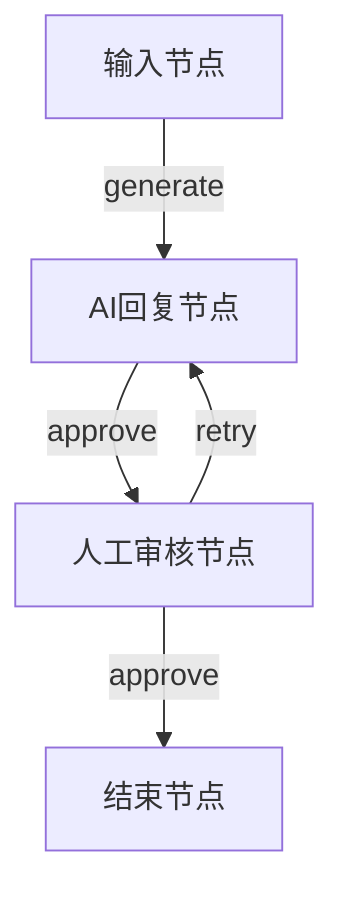

# Human Evaluation（人工评估系统）

## 项目简介

Human Evaluation 是一个基于 PocketFlowSharp 框架开发的人工评估系统，它实现了一个人机协作的工作流程，让用户能够与 AI 进行交互，并对 AI 的回复进行人工审核。这个系统特别适合需要 AI 辅助但同时需要人工把关的场景。

## 工作原理

系统采用节点式流程设计，主要包含以下几个核心节点：

1. **任务输入节点 (TaskInputNode)**
   - 负责接收用户输入的任务
   - 将任务保存到共享数据中

2. **AI响应节点 (AIResponseNode)**
   - 接收任务并调用 AI 模型生成回复
   - 支持流式输出，实时显示 AI 的回复内容
   - 记录生成尝试次数

3. **人工审批节点 (HumanApprovalNode)**
   - 展示 AI 的回复并等待用户评估
   - 用户可以选择接受或拒绝 AI 的回复
   - 如果拒绝，流程会返回到 AI 响应节点重新生成

流程图：




## 使用流程

1. **环境配置**
   - 确保项目根目录下存在 `.env` 文件
   - 在 `.env` 文件中配置以下参数：
     ```
     ModelName=你的模型名称
     EndPoint=API端点地址
     ApiKey=你的API密钥
     ```

2. **运行程序**
   - 启动程序后，系统会显示欢迎信息
   - 按照提示输入需要 AI 处理的任务
   - AI 会实时生成并显示回复内容
   - 系统会询问是否接受 AI 的回复
     - 输入 'y' 接受回复并结束流程
     - 输入 'n' 拒绝回复，AI 将重新生成

## 特色功能

- **流式输出**: AI 回复采用流式输出方式，用户可以实时看到生成过程
- **多次尝试**: 支持多次重新生成，直到得到满意的结果
- **人工把关**: 确保每个 AI 生成的回复都经过人工审核
- **彩色输出**: AI 回复使用绿色文字显示，提升用户体验

## 使用场景

- 内容生成与审核
- AI 辅助写作
- 自动回复系统
- 需要人工质量控制的 AI 应用

## 注意事项

1. 使用前请确保正确配置 `.env` 文件
2. 确保网络连接正常，能够访问 AI API
3. 建议在每次重新生成前仔细考虑拒绝的原因，以便获得更好的结果

## 扩展开发

系统基于 PocketFlowSharp 框架开发，如需扩展功能，可以：

1. 添加新的节点类型
2. 修改现有节点的行为
3. 调整流程连接方式
4. 增加更多的共享数据字段

## 技术依赖

- PocketFlowSharp 框架
- OpenAI API
- dotenv.net 

## 运行效果


